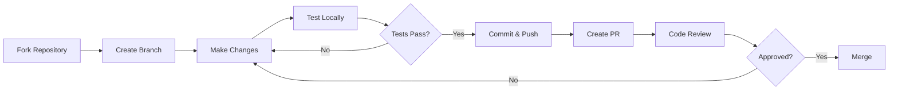

# Contributing to Claude Code Plugins

Thank you for your interest in contributing to the Claude Code Plugins repository! This document provides guidelines and instructions for contributing.

## Table of Contents

- [Code of Conduct](#code-of-conduct)
- [Getting Started](#getting-started)
- [Development Setup](#development-setup)
- [How to Contribute](#how-to-contribute)
- [Plugin Development Guidelines](#plugin-development-guidelines)
- [Testing Your Changes](#testing-your-changes)
- [Submitting Changes](#submitting-changes)
- [Review Process](#review-process)
- [Community](#community)

## Code of Conduct

We are committed to providing a welcoming and inclusive environment. By participating in this project, you agree to:

- Be respectful and considerate
- Welcome newcomers and help them learn
- Focus on what is best for the community
- Show empathy towards other community members

## Getting Started

### Prerequisites

Before contributing, ensure you have:

- **Git** - Version control
- **Claude Code** - Install globally: `npm install -g @anthropic-ai/claude-code`
- **Node.js** - v18+ (for Node.js-based hooks)
- **Python 3** - For Python-based hooks
- **jq** - JSON processor (for validation scripts)

### Quick Start

1. **Fork the repository**
   ```bash
   # On GitHub, click "Fork" button
   ```

2. **Clone your fork**
   ```bash
   git clone https://github.com/YOUR-USERNAME/claude-code-plugins.git
   cd claude-code-plugins
   ```

3. **Create a feature branch**
   ```bash
   git checkout -b feature/your-feature-name
   ```

4. **Make your changes**

5. **Test your changes**
   ```bash
   ./Script/validate-all.sh
   ./Script/debug-plugins.sh
   ```

6. **Commit and push**
   ```bash
   git add .
   git commit -m "feat: Add your feature description"
   git push origin feature/your-feature-name
   ```

7. **Create a Pull Request**

## Development Setup

### Using DevContainer (Recommended)

The repository includes a DevContainer configuration for consistent development:

1. **Prerequisites:**
   - VS Code with Remote-Containers extension
   - Docker Desktop

2. **Open in DevContainer:**
   ```bash
   # In VS Code, run: Remote-Containers: Open Folder in Container
   ```

3. **Everything is pre-configured:**
   - Claude Code installed
   - All dependencies (jq, git, etc.)
   - Validation scripts ready

### Manual Setup

1. **Install Claude Code:**
   ```bash
   npm install -g @anthropic-ai/claude-code
   ```

2. **Install dependencies:**
   ```bash
   # macOS
   brew install jq

   # Ubuntu/Debian
   sudo apt-get install jq

   # Windows (with Chocolatey)
   choco install jq
   ```

3. **Install Git Hooks (optional but recommended):**
   ```bash
   ./Script/install-git-hooks.sh
   ```

## How to Contribute

### Types of Contributions

We welcome various types of contributions:

1. **New Plugins**
   - Commands for user workflows
   - Skills for contextual assistance
   - Agents for specialized tasks
   - Hooks for automation

2. **Bug Fixes**
   - Fix bugs in existing plugins
   - Improve error handling
   - Fix documentation errors

3. **Documentation**
   - Improve existing documentation
   - Add examples and tutorials
   - Translate documentation

4. **Testing**
   - Add test cases
   - Improve validation scripts
   - Test cross-platform compatibility

5. **Infrastructure**
   - Improve CI/CD workflows
   - Enhance validation scripts
   - Add development tools

### Contribution Workflow



## Plugin Development Guidelines

### Plugin Structure

Follow the standard plugin structure:

```
plugins/
└── your-plugin-name/
    ├── .claude-plugin/
    │   └── plugin.json          # Required: Plugin metadata
    ├── commands/                 # Optional: Slash commands
    │   └── command-name.md
    ├── agents/                   # Optional: Specialized agents
    │   └── agent-name.md
    ├── skills/                   # Optional: Skills
    │   └── skill-name/
    │       └── SKILL.md
    ├── hooks/                    # Optional: Event hooks
    │   ├── hooks.json
    │   └── script.sh
    └── README.md                # Required: Plugin documentation
```

### Best Practices

#### 1. Plugin Metadata (plugin.json)

```json
{
  "name": "your-plugin-name",
  "description": "Clear, concise description (100-200 chars)",
  "version": "1.0.0",
  "author": {
    "name": "Your Name",
    "email": "your@email.com"
  },
  "keywords": [
    "keyword1",
    "keyword2",
    "keyword3"
  ],
  "repository": {
    "type": "git",
    "url": "https://github.com/xrf9268-hue/claude-code-plugins"
  },
  "license": "MIT"
}
```

**Requirements:**
- Use kebab-case for `name`
- Include 5-10 relevant keywords
- Follow semantic versioning
- Keep description concise but descriptive

#### 2. Commands

```markdown
---
description: Clear description for /help
allowed-tools: Bash(git:*), Read, Grep
---

# Command Documentation

Clear instructions for what Claude should do...
```

**Best Practices:**
- Always include `description` field
- Restrict tools with `allowed-tools` when possible
- Use `!` prefix for dynamic context injection
- Keep commands focused on single tasks

#### 3. Agents

```markdown
---
name: agent-name
description: When to invoke this agent with specific scenarios
tools: Read, Grep, Glob
model: sonnet
color: blue
---

# Agent System Prompt

Detailed instructions for this specialized agent...
```

**Best Practices:**
- Single responsibility per agent
- Restrict tools to minimum necessary
- Choose appropriate model (haiku/sonnet/opus/inherit)
- Include invocation examples in description

#### 4. Skills

```markdown
---
name: skill-name
description: Rich, keyword-heavy description covering all use cases and trigger scenarios
allowed-tools: Read, Grep
---

# Skill Documentation

Comprehensive guidance for this capability...
```

**Best Practices:**
- Rich descriptions for better activation
- Include activation triggers in description
- Use modular resource files for large skills
- Keep SKILL.md focused

#### 5. Hooks

```json
{
  "description": "Hook description",
  "hooks": {
    "PreToolUse": [
      {
        "hooks": [
          {
            "type": "command",
            "command": "bash ${CLAUDE_PLUGIN_ROOT}/hooks/script.sh"
          }
        ],
        "matcher": "Edit|Write"
      }
    ]
  }
}
```

**Best Practices:**
- Always use `${CLAUDE_PLUGIN_ROOT}` variable
- Validate all inputs
- Exit 0 on errors (fail safely)
- Exit 2 to block PreToolUse operations
- Execute quickly (<1 second)
- Use portable shebangs (#!/usr/bin/env)

### Naming Conventions

- **Plugins:** `kebab-case` (e.g., `my-plugin`)
- **Commands:** `kebab-case` (e.g., `my-command`)
- **Agents:** `kebab-case` (e.g., `my-agent`)
- **Skills:** `kebab-case` (e.g., `my-skill`)
- **Files:** `kebab-case.md` or `snake_case.py`

### File Permissions

Ensure hook scripts are executable:

```bash
chmod +x plugins/your-plugin/hooks/*.sh
chmod +x plugins/your-plugin/hooks/*.py
chmod +x plugins/your-plugin/hooks/*.js
```

## Testing Your Changes

### 1. Run Validation Script

```bash
./Script/validate-all.sh
```

This checks:
- JSON syntax
- Required fields
- Naming conventions
- Hook structure
- File permissions
- Security patterns

### 2. Debug Plugin Functionality

```bash
./Script/debug-plugins.sh
```

This tests:
- Plugin loading
- Command execution
- Agent invocation
- Skill activation
- Hook triggering

### 3. Test Manually with Claude Code

```bash
cd claude-code-plugins
claude

# Test your plugin
/plugin install file://./plugins/your-plugin
/your-command
```

### 4. Cross-Platform Testing

Test on multiple platforms if possible:

- **macOS** - Test native installation
- **Linux (Ubuntu)** - Test in DevContainer or VM
- **Windows** - Test in WSL2

### 5. Check Documentation

- README.md is complete
- Examples are accurate
- Installation instructions work
- All links are valid

## Submitting Changes

### Commit Messages

Follow [Conventional Commits](https://www.conventionalcommits.org/):

```
<type>(<scope>): <subject>

<body>

<footer>
```

**Types:**
- `feat:` - New feature
- `fix:` - Bug fix
- `docs:` - Documentation changes
- `style:` - Code style changes (formatting)
- `refactor:` - Code refactoring
- `test:` - Test additions or changes
- `chore:` - Build process or auxiliary tool changes

**Examples:**
```bash
feat(commit-commands): Add /squash-commits command

Add new command to squash recent commits interactively.
Includes validation and safety checks.

Closes #123

---

fix(security-guidance): Fix false positive in XSS detection

The innerHTML pattern was too broad and caught valid cases.
Refined pattern to reduce false positives.

---

docs(README): Update installation instructions

Add DevContainer setup instructions and troubleshooting section.
```

### Pull Request Guidelines

1. **Title:** Clear, descriptive title following commit message format
   ```
   feat(plugin-name): Add new feature
   ```

2. **Description:** Include:
   - What changes were made
   - Why the changes were needed
   - How to test the changes
   - Screenshots (if applicable)
   - Related issues

3. **Template:**
   ```markdown
   ## Description
   Brief description of changes

   ## Motivation
   Why is this change needed?

   ## Changes
   - Change 1
   - Change 2

   ## Testing
   - [ ] Ran ./Script/validate-all.sh
   - [ ] Ran ./Script/debug-plugins.sh
   - [ ] Tested manually with Claude Code
   - [ ] Tested on multiple platforms (if applicable)

   ## Screenshots
   (If applicable)

   ## Checklist
   - [ ] Code follows style guidelines
   - [ ] Documentation updated
   - [ ] Tests pass
   - [ ] Commit messages follow conventions
   ```

4. **Small PRs:** Keep PRs focused and small when possible

5. **One Concern Per PR:** Address one feature/bug per PR

## Review Process

### What Happens After You Submit

1. **Automated Checks** (2-5 minutes)
   - CI/CD validation runs
   - JSON syntax checking
   - Hook structure validation
   - Security scanning

2. **Code Review** (1-7 days)
   - Maintainer reviews code
   - Feedback provided
   - Changes requested (if needed)

3. **Approval** (after changes addressed)
   - Maintainer approves PR
   - PR merged to main branch

4. **Release** (varies)
   - Changes included in next release
   - CHANGELOG updated
   - Version tagged

### Review Criteria

Reviewers will check:

- [ ] Code follows best practices
- [ ] Plugin structure is correct
- [ ] Documentation is complete
- [ ] Tests pass
- [ ] No security vulnerabilities
- [ ] Cross-platform compatible
- [ ] Commit messages follow conventions

### Addressing Feedback

1. **Read carefully** - Understand the feedback
2. **Ask questions** - If anything is unclear
3. **Make changes** - Address the feedback
4. **Push updates** - To the same branch
5. **Respond** - Comment when changes are made

## Style Guide

### Code Style

**Python:**
```python
#!/usr/bin/env python3
"""
Module docstring describing the hook's purpose.
"""

import json
import sys


def main():
    """Main function with clear purpose."""
    # Implementation
    pass


if __name__ == "__main__":
    main()
```

**JavaScript:**
```javascript
#!/usr/bin/env node

/**
 * Hook description
 */

const fs = require('fs');

function main() {
  // Implementation
}

main();
```

**Bash:**
```bash
#!/bin/bash
# Hook description

set -e  # Exit on error

# Implementation
```

### Documentation Style

- Use clear, concise language
- Include examples
- Use code blocks with syntax highlighting
- Add links to relevant documentation
- Use bullet points for lists
- Include "Why" not just "How"

### Markdown Style

- Use ATX-style headers (`#` not underlines)
- One sentence per line (for easier diffs)
- Use fenced code blocks with language tags
- Include table of contents for long documents

## Community

### Get Help

- **GitHub Discussions** - Ask questions, share ideas
- **Issues** - Report bugs, request features
- **Discord** - [Claude Developers Discord](https://anthropic.com/discord)

### Stay Updated

- **Watch Repository** - Get notifications for new releases
- **Star Repository** - Show your support
- **Follow Releases** - Get update notifications

### Recognition

Contributors are recognized in:

- Pull request acknowledgments
- Release notes
- CHANGELOG.md
- Project documentation

## Additional Resources

### Official Documentation

- [Claude Code Documentation](https://docs.anthropic.com/en/docs/claude-code/overview)
- [Plugins Guide](https://code.claude.com/docs/en/plugins)
- [Skills Guide](https://code.claude.com/docs/en/skills)
- [Hooks Guide](https://code.claude.com/docs/en/hooks-guide)
- [Sub-Agents Guide](https://code.claude.com/docs/en/sub-agents)

### Repository Documentation

- [QUICK-REFERENCE.md](docs/QUICK-REFERENCE.md) - Quick reference guide
- [PLUGIN_MAINTENANCE_GUIDE.md](docs/PLUGIN_MAINTENANCE_GUIDE.md) - Maintenance standards
- [PLUGIN_DEBUGGING_GUIDE.md](docs/PLUGIN_DEBUGGING_GUIDE.md) - Debugging guide
- [PLATFORM_COMPATIBILITY.md](docs/PLATFORM_COMPATIBILITY.md) - Platform compatibility

### Development Guides

- [AGENTS-DEVELOPMENT-GUIDE.md](docs/AGENTS-DEVELOPMENT-GUIDE.md) - Agent development
- [HOOKS-DEVELOPMENT-GUIDE.md](docs/HOOKS-DEVELOPMENT-GUIDE.md) - Hook development
- [INTEGRATING-SKILLS-IN-PLUGINS.md](docs/INTEGRATING-SKILLS-IN-PLUGINS.md) - Skills integration

## Questions?

If you have questions not covered in this guide:

1. Check [existing issues](https://github.com/xrf9268-hue/claude-code-plugins/issues)
2. Search [discussions](https://github.com/xrf9268-hue/claude-code-plugins/discussions)
3. Ask in [Claude Developers Discord](https://anthropic.com/discord)
4. Create a new discussion

## Thank You!

Thank you for contributing to Claude Code Plugins! Your contributions help make this project better for everyone.

---

**Last Updated:** 2024-11-22

Happy coding! 🚀
