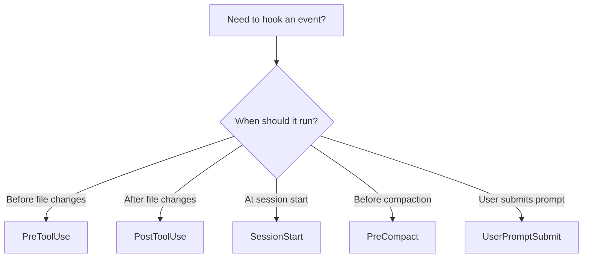

# Claude Code Hooks Development Guide

Complete guide to developing hooks for Claude Code plugins. Hooks are event handlers that execute in response to lifecycle events, enabling workflow automation, validation, and context preservation.

## Table of Contents

- [What are Hooks?](#what-are-hooks)
- [Hook Types](#hook-types)
- [When to Use Hooks](#when-to-use-hooks)
- [Development Workflow](#development-workflow)
- [Hook Configuration](#hook-configuration)
- [Writing Hook Scripts](#writing-hook-scripts)
- [Environment Variables](#environment-variables)
- [Exit Codes and Output](#exit-codes-and-output)
- [Security Best Practices](#security-best-practices)
- [Real-World Examples](#real-world-examples)
- [Testing and Debugging](#testing-and-debugging)
- [Troubleshooting](#troubleshooting)

## What are Hooks?

Hooks are event handlers that respond to specific events in Claude Code's lifecycle. They allow you to:

- **Validate operations** before they execute (PreToolUse)
- **Post-process results** after operations complete (PostToolUse)
- **Initialize environments** at session start (SessionStart)
- **Preserve context** before compaction (PreCompact)
- **Clean up resources** at session end (SessionEnd)
- **Intercept user input** before processing (UserPromptSubmit)

### Key Characteristics

- 🎯 **Event-driven**: Triggered by specific lifecycle events
- ⚡ **Fast execution**: Should complete quickly to avoid blocking
- 🔒 **Secure by default**: Run with user permissions, validate all inputs
- 🔄 **Composable**: Multiple hooks can respond to the same event

## Hook Types

### Command Hooks

Execute bash scripts in response to events.

**Use cases:**
- Run linters or formatters
- Validate file changes
- Execute security checks
- Initialize environments

**Example:**
```json
{
  "type": "command",
  "command": "python3 ${CLAUDE_PLUGIN_ROOT}/hooks/security_check.py"
}
```

### Prompt Hooks

Query an LLM for context-aware decisions (advanced).

**Use cases:**
- Intelligent validation (context-dependent)
- Dynamic permission decisions
- Adaptive workflow control

**Supported events:** Stop, SubagentStop, UserPromptSubmit, PreToolUse

**Example:**
```json
{
  "type": "prompt",
  "prompt": "Analyze if this tool use is safe given the current context..."
}
```

## When to Use Hooks

| Event | When to Use | Example Use Cases |
|-------|-------------|-------------------|
| **PreToolUse** | Validate before file operations | Security checks, linting, format validation |
| **PostToolUse** | Post-process after operations | Auto-formatting, notifications, logging |
| **SessionStart** | Initialize environment | Load config, validate dependencies, set env vars |
| **SessionEnd** | Clean up resources | Save state, cleanup temp files |
| **PreCompact** | Preserve important context | Extract decisions, save architecture notes |
| **UserPromptSubmit** | Intercept/modify user input | Add context, validate requests |
| **Stop** | Handle user interruptions | Save work-in-progress, cleanup |
| **SubagentStop** | Handle subagent interruptions | Aggregate subagent results |

## Development Workflow

### Step 1: Choose Your Event

Determine which lifecycle event best fits your needs:



### Step 2: Create hooks.json

Create `hooks/hooks.json` in your plugin:

```json
{
  "description": "Brief description of what these hooks do",
  "hooks": {
    "PreToolUse": [
      {
        "matcher": "Edit|Write|MultiEdit",
        "hooks": [
          {
            "type": "command",
            "command": "python3 ${CLAUDE_PLUGIN_ROOT}/hooks/validate.py"
          }
        ]
      }
    ]
  }
}
```

### Step 3: Write Hook Script

Create your hook script (e.g., `hooks/validate.py`):

```python
#!/usr/bin/env python3
import sys
import json

def main():
    # Read tool use data from stdin
    tool_use = json.loads(sys.stdin.read())

    # Perform validation
    if not is_valid(tool_use):
        # Block operation
        sys.stderr.write("Validation failed: ...")
        sys.exit(2)

    # Allow operation
    print("Validation passed")
    sys.exit(0)

if __name__ == "__main__":
    main()
```

### Step 4: Make Script Executable

```bash
chmod +x hooks/validate.py
```

### Step 5: Test

Test your hook by triggering the event:

```bash
# Start Claude Code with your plugin
claude

# Trigger the event (e.g., edit a file for PreToolUse)
# Observe hook behavior
```

## Hook Configuration

### hooks.json Schema

```json
{
  "description": "Optional description",
  "hooks": {
    "EventName": [
      {
        "matcher": "ToolPattern",  // For tool-based events
        "hooks": [
          {
            "type": "command|prompt",
            "command": "...",         // For command type
            "prompt": "...",          // For prompt type
            "timeout": 60000          // Optional, milliseconds
          }
        ]
      }
    ]
  }
}
```

### Matcher Patterns

Matchers filter which tools trigger the hook (case-sensitive):

```json
// Exact match
"matcher": "Edit"

// Multiple tools (regex OR)
"matcher": "Edit|Write|MultiEdit"

// All tools
"matcher": "*"
// or
"matcher": ""

// Regex patterns
"matcher": "Bash.*"     // Any Bash command
"matcher": "Notebook.*" // Any notebook operation
```

### Event Types

#### Tool-Based Events (require matcher)

**PreToolUse:**
```json
{
  "PreToolUse": [
    {
      "matcher": "Edit|Write",
      "hooks": [{ "type": "command", "command": "..." }]
    }
  ]
}
```

**PostToolUse:**
```json
{
  "PostToolUse": [
    {
      "matcher": "*",
      "hooks": [{ "type": "command", "command": "..." }]
    }
  ]
}
```

#### Lifecycle Events (no matcher needed)

**SessionStart:**
```json
{
  "SessionStart": [
    {
      "hooks": [{ "type": "command", "command": "..." }]
    }
  ]
}
```

**PreCompact:**
```json
{
  "PreCompact": [
    {
      "hooks": [{ "type": "command", "command": "..." }]
    }
  ]
}
```

**UserPromptSubmit:**
```json
{
  "UserPromptSubmit": [
    {
      "hooks": [{ "type": "command", "command": "..." }]
    }
  ]
}
```

## Writing Hook Scripts

### Input Format

Hooks receive JSON data via stdin:

```python
import sys
import json

# Read input
data = json.loads(sys.stdin.read())

# data structure depends on event type
```

### PreToolUse Input

```json
{
  "toolName": "Edit",
  "parameters": {
    "file_path": "/path/to/file.js",
    "old_string": "...",
    "new_string": "..."
  }
}
```

### PostToolUse Input

```json
{
  "toolName": "Edit",
  "parameters": { ... },
  "result": "success|error",
  "output": "..."
}
```

### SessionStart Input

```json
{
  "projectDir": "/path/to/project",
  "timestamp": "2025-11-09T..."
}
```

### Output Methods

#### Simple Method: Exit Codes

```bash
#!/bin/bash

# Success (allow operation)
echo "Check passed"
exit 0

# Block operation (error)
echo "Check failed" >&2
exit 2
```

#### Advanced Method: JSON Output

```python
import json
import sys

output = {
    "continue": True,  # or False to halt processing
    "permissionDecision": "allow",  # "allow", "deny", "ask"
    "additionalContext": "Extra info for Claude",
    "updatedInput": { ... }  # Modify tool parameters
}

print(json.dumps(output))
sys.exit(0)
```

## Environment Variables

### Available to All Hooks

```bash
# Project root directory
CLAUDE_PROJECT_DIR="/path/to/project"

# Plugin root (for hooks in plugins)
CLAUDE_PLUGIN_ROOT="/path/to/plugin"

# Remote vs local execution
CLAUDE_CODE_REMOTE="true"  # or "false"
```

### SessionStart Only

```bash
# File for persisting environment variables
CLAUDE_ENV_FILE="/path/to/env/file"
```

### Using in hooks.json

```json
{
  "type": "command",
  "command": "python3 ${CLAUDE_PLUGIN_ROOT}/hooks/script.py"
}
```

### Using in Scripts

```python
import os

project_dir = os.environ.get('CLAUDE_PROJECT_DIR')
plugin_root = os.environ.get('CLAUDE_PLUGIN_ROOT')
```

## Exit Codes and Output

### Exit Code Behavior

| Code | Meaning | stdout Behavior | stderr Behavior |
|------|---------|----------------|-----------------|
| **0** | Success | Shown in transcript* | Ignored |
| **2** | Blocking error | Ignored | Fed back to Claude |
| **Other** | Non-blocking error | Ignored | Shown to user |

*Exception: SessionStart and UserPromptSubmit add stdout as context instead

### Examples

**Allow operation:**
```python
print("Security check passed")
sys.exit(0)
```

**Block operation with feedback:**
```python
sys.stderr.write("Security issue: XSS vulnerability detected\n")
sys.exit(2)
```

**Non-blocking warning:**
```python
sys.stderr.write("Warning: Consider using const instead of let\n")
sys.exit(1)
```

## Security Best Practices

### 1. Validate All Inputs

```python
def validate_path(path):
    # Check for path traversal
    if ".." in path:
        return False

    # Ensure path is within project
    abs_path = os.path.abspath(path)
    project_dir = os.environ.get('CLAUDE_PROJECT_DIR')

    if not abs_path.startswith(project_dir):
        return False

    return True
```

### 2. Quote Shell Variables

```bash
# ❌ Bad: Unquoted variables
cd $CLAUDE_PROJECT_DIR

# ✅ Good: Quoted variables
cd "$CLAUDE_PROJECT_DIR"
```

### 3. Sanitize Inputs

```python
import shlex

def safe_command(user_input):
    # Sanitize for shell execution
    return shlex.quote(user_input)
```

### 4. Skip Sensitive Files

```python
SENSITIVE_PATTERNS = ['.env', '.git/', 'credentials', 'secrets']

def is_sensitive(file_path):
    return any(pattern in file_path for pattern in SENSITIVE_PATTERNS)

if is_sensitive(file_path):
    print("Skipping sensitive file")
    sys.exit(0)
```

### 5. Use Absolute Paths

```python
# ✅ Good: Use absolute paths or environment variables
script_dir = os.path.join(
    os.environ['CLAUDE_PLUGIN_ROOT'],
    'hooks',
    'scripts'
)
```

### 6. Limit Execution Time

```json
{
  "type": "command",
  "command": "python3 script.py",
  "timeout": 5000  // 5 seconds max
}
```

## Real-World Examples

### Example 1: Security Validation Hook

**Use case:** Check for common security vulnerabilities before writing code

**File:** `hooks/hooks.json`
```json
{
  "description": "Security validation hook",
  "hooks": {
    "PreToolUse": [
      {
        "matcher": "Edit|Write|MultiEdit",
        "hooks": [
          {
            "type": "command",
            "command": "python3 ${CLAUDE_PLUGIN_ROOT}/hooks/security_check.py"
          }
        ]
      }
    ]
  }
}
```

**File:** `hooks/security_check.py`
```python
#!/usr/bin/env python3
import sys
import json
import re

# Security patterns to detect
SECURITY_PATTERNS = [
    {
        "name": "XSS via innerHTML",
        "pattern": r"\.innerHTML\s*=",
        "message": "Use textContent instead of innerHTML to prevent XSS"
    },
    {
        "name": "SQL Injection",
        "pattern": r"execute\s*\(\s*['\"].*\+",
        "message": "Use parameterized queries to prevent SQL injection"
    },
    {
        "name": "Command Injection",
        "pattern": r"os\.system\s*\(",
        "message": "Use subprocess with argument lists to prevent command injection"
    }
]

def check_content(content):
    issues = []
    for pattern_def in SECURITY_PATTERNS:
        if re.search(pattern_def["pattern"], content):
            issues.append(pattern_def)
    return issues

def main():
    try:
        data = json.loads(sys.stdin.read())

        # Get new content
        new_content = data.get("parameters", {}).get("new_string", "")
        if not new_content:
            new_content = data.get("parameters", {}).get("content", "")

        # Check for security issues
        issues = check_content(new_content)

        if issues:
            error_msg = "⚠️  Security Warning:\n\n"
            for issue in issues:
                error_msg += f"- {issue['name']}: {issue['message']}\n"

            sys.stderr.write(error_msg)
            sys.exit(2)  # Block operation

        print("Security check passed")
        sys.exit(0)

    except Exception as e:
        # Don't block on errors
        sys.stderr.write(f"Hook error: {str(e)}\n")
        sys.exit(0)

if __name__ == "__main__":
    main()
```

### Example 2: Auto-Format Hook

**Use case:** Automatically format code after editing

**File:** `hooks/hooks.json`
```json
{
  "hooks": {
    "PostToolUse": [
      {
        "matcher": "Edit|Write",
        "hooks": [
          {
            "type": "command",
            "command": "bash ${CLAUDE_PLUGIN_ROOT}/hooks/auto_format.sh"
          }
        ]
      }
    ]
  }
}
```

**File:** `hooks/auto_format.sh`
```bash
#!/bin/bash

# Read input
input=$(cat)

# Extract file path
file_path=$(echo "$input" | jq -r '.parameters.file_path // empty')

if [ -z "$file_path" ]; then
    exit 0
fi

# Format based on file type
case "$file_path" in
    *.py)
        black "$file_path" 2>/dev/null
        ;;
    *.js|*.ts)
        prettier --write "$file_path" 2>/dev/null
        ;;
    *.go)
        gofmt -w "$file_path" 2>/dev/null
        ;;
esac

echo "Formatted: $file_path"
exit 0
```

### Example 3: Context Preservation Hook

**Use case:** Save important context before compaction

**File:** `hooks/hooks.json`
```json
{
  "hooks": {
    "PreCompact": [
      {
        "hooks": [
          {
            "type": "command",
            "command": "node ${CLAUDE_PLUGIN_ROOT}/hooks/preserve_context.js"
          }
        ]
      }
    ]
  }
}
```

**File:** `hooks/preserve_context.js`
```javascript
#!/usr/bin/env node

const fs = require('fs');
const path = require('path');

// Read conversation data from stdin
const data = JSON.parse(fs.readFileSync(0, 'utf-8'));

// Extract important patterns
const importantPatterns = [
    /decided to use/i,
    /architecture/i,
    /performance.*optimiz/i,
    /bug.*caused by/i,
    /tradeoff/i
];

const importantMessages = data.conversationHistory
    .filter(msg =>
        importantPatterns.some(pattern => pattern.test(msg.content))
    )
    .map(msg => ({
        timestamp: msg.timestamp,
        content: msg.content,
        role: msg.role
    }));

// Save to project .claude/context directory
const projectDir = process.env.CLAUDE_PROJECT_DIR;
const contextDir = path.join(projectDir, '.claude', 'context');

fs.mkdirSync(contextDir, { recursive: true });

const timestamp = new Date().toISOString().replace(/:/g, '-');
const filename = path.join(contextDir, `context_${timestamp}.json`);

fs.writeFileSync(filename, JSON.stringify({
    timestamp: new Date().toISOString(),
    importantDecisions: importantMessages
}, null, 2));

console.log(`Preserved ${importantMessages.length} important messages`);
process.exit(0);
```

### Example 4: Environment Validation Hook

**Use case:** Validate dependencies at session start

**File:** `hooks/hooks.json`
```json
{
  "hooks": {
    "SessionStart": [
      {
        "hooks": [
          {
            "type": "command",
            "command": "bash ${CLAUDE_PLUGIN_ROOT}/hooks/validate_env.sh"
          }
        ]
      }
    ]
  }
}
```

**File:** `hooks/validate_env.sh`
```bash
#!/bin/bash

PROJECT_DIR="$CLAUDE_PROJECT_DIR"

echo "🔍 Validating development environment..."

# Check Node.js
if ! command -v node &> /dev/null; then
    echo "⚠️  Warning: Node.js not found" >&2
fi

# Check package.json dependencies
if [ -f "$PROJECT_DIR/package.json" ]; then
    if [ ! -d "$PROJECT_DIR/node_modules" ]; then
        echo "⚠️  Warning: node_modules not found. Run 'npm install'" >&2
    fi
fi

# Check Python virtual environment
if [ -f "$PROJECT_DIR/requirements.txt" ]; then
    if [ -z "$VIRTUAL_ENV" ]; then
        echo "⚠️  Tip: Consider activating Python virtual environment" >&2
    fi
fi

echo "✅ Environment validation complete"
exit 0
```

## Testing and Debugging

### Test Individual Hooks

```bash
# Test hook script directly
echo '{"toolName":"Edit","parameters":{"file_path":"test.js"}}' | \
    python3 hooks/security_check.py
```

### Enable Debug Mode

```bash
# Run Claude Code with debug logging
claude --debug

# Check hook execution in logs
```

### Test Hook Activation

1. Install plugin with hooks
2. Trigger the relevant event
3. Check console output for hook execution
4. Verify expected behavior

### Common Issues

**Hook not executing:**
- ✅ Check hooks.json is valid JSON
- ✅ Verify script is executable (`chmod +x`)
- ✅ Check matcher pattern matches tool name
- ✅ Ensure plugin is properly installed

**Hook blocking unexpectedly:**
- ✅ Check exit code (should be 2 to block)
- ✅ Review stderr output for error messages
- ✅ Test script independently

**Environment variables not available:**
- ✅ Verify using `${CLAUDE_PLUGIN_ROOT}` syntax
- ✅ Check if variable exists for this event type
- ✅ Use `os.environ.get()` with defaults

## Troubleshooting

### Hook Script Errors

**Problem:** Script crashes or returns unexpected results

**Solutions:**
1. Test script independently with sample input
2. Add error handling and logging
3. Check for missing dependencies
4. Validate input format

```python
try:
    data = json.loads(sys.stdin.read())
except json.JSONDecodeError as e:
    sys.stderr.write(f"Invalid JSON: {e}\n")
    sys.exit(0)  # Don't block on hook errors
```

### Permission Issues

**Problem:** Hook can't access files or execute commands

**Solutions:**
1. Ensure script is executable
2. Check file permissions
3. Use absolute paths or environment variables
4. Verify user has necessary permissions

### Performance Issues

**Problem:** Hook slows down operations

**Solutions:**
1. Set reasonable timeout
2. Optimize script performance
3. Run expensive operations asynchronously
4. Cache results when possible

```json
{
  "type": "command",
  "command": "...",
  "timeout": 5000  // 5 second limit
}
```

### Debugging Tips

**Add logging:**
```python
import logging

logging.basicConfig(
    filename='/tmp/hook.log',
    level=logging.DEBUG
)

logging.debug(f"Hook input: {data}")
```

**Use JSON formatting:**
```bash
# Pretty-print JSON input for debugging
echo "$input" | jq '.'
```

**Test incrementally:**
1. Start with simple hook that always succeeds
2. Add validation logic incrementally
3. Test each addition thoroughly

## Best Practices Summary

### Design

✅ **Keep hooks fast** - Should complete in < 1 second
✅ **Fail safely** - Exit 0 on hook errors, don't block user
✅ **Be specific** - Target only relevant tools with matchers
✅ **Handle errors gracefully** - Catch exceptions, provide helpful messages

### Security

✅ **Validate all inputs** - Never trust data blindly
✅ **Quote variables** - Prevent injection attacks
✅ **Skip sensitive files** - .env, credentials, etc.
✅ **Use absolute paths** - Or environment variables

### Implementation

✅ **Use environment variables** - `${CLAUDE_PLUGIN_ROOT}`
✅ **Make scripts executable** - `chmod +x hooks/*.sh`
✅ **Test thoroughly** - Test both success and failure paths
✅ **Document behavior** - Clear comments and hook descriptions

### Performance

✅ **Set timeouts** - Prevent hanging operations
✅ **Cache when possible** - Avoid redundant work
✅ **Run async when needed** - Don't block user unnecessarily
✅ **Profile slow hooks** - Identify and optimize bottlenecks

## Additional Resources

### Official Documentation
- [Hooks Guide](https://code.claude.com/docs/en/hooks-guide)
- [Hooks Reference](https://code.claude.com/docs/en/hooks)
- [Plugin Reference](https://code.claude.com/docs/en/plugins-reference)

### Example Plugins with Hooks
- [security-guidance](../plugins/security-guidance/) - PreToolUse security checks
- [context-preservation](../plugins/context-preservation/) - PreCompact context saving
- [explanatory-output-style](../plugins/explanatory-output-style/) - Output formatting hooks

### Related Guides
- [Skills Development](./INTEGRATING-SKILLS-IN-PLUGINS.md)
- [Agents Development](./AGENTS-DEVELOPMENT-GUIDE.md)
- [Plugin Installation](./QUICK_PLUGIN_INSTALLATION.md)

---

**Questions or feedback?** Join the [Claude Developers Discord](https://anthropic.com/discord) to connect with other hook developers.

**Last Updated:** 2025-11-09
**Version:** 1.0.0
